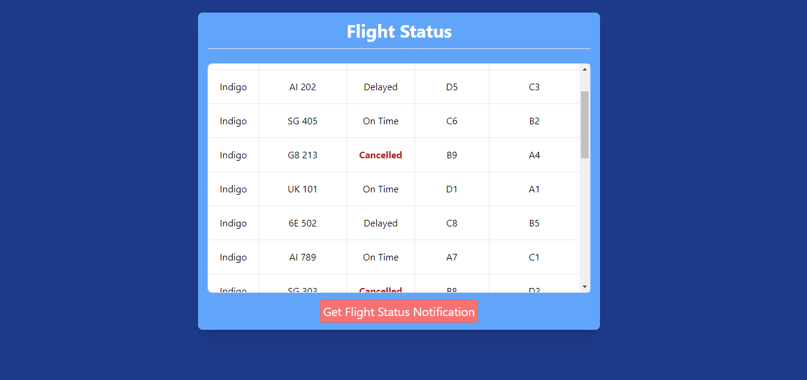
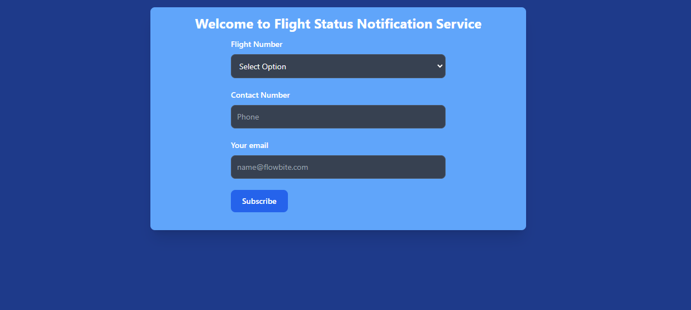
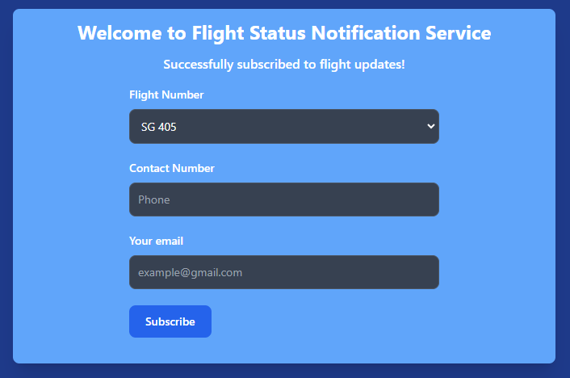
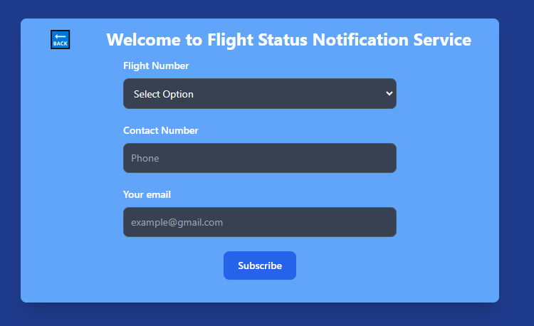

# Case study for full stack developer 

### [Linkdein](https://linkedin.com/in/sudo-abhinav/)
### [Github](https://github.com/sudo-abhinav)
----------------------

### Problem Statement: Flight Status and Notifications

### Description: Develop a system to provide real-time flight status updates and notifications to passengers.
- ### what am trying todo 
  - First am creating a Flight endPoint to get add all Flight data , if user 
        don't want to notification Justt check their flist status on all flight 
        Table   
  - And Second Endpoint is we fetch all flight Number and tell user to select
         your flight number and enter Phone Number and Email to get Notification on 
         their both  then we send notification on mobile nuber using twillio 
         and sending notification on mail using nodemailer and we store user
         mobile number and emailid along with Flight Number for future reference.


* #### Tech Stack
   - FrontEnd : *React* ,*axios* , *Tailwind Css*.
        - react : react use for frontend for easy UI.
        - axios : am using axios for handling API.
         - Tailwind CSS :- tailwind using for Good Design.
   - Backend : *Express* , *nodemailer* , *dotenv*,*sequelize* , *twilio* , *SupabaseDB-postgre* 
        - Express : am using express creating API.
        - SupabaseDB-postgre: supabase is using for online postgreDB Database server  
        - nodeMailer : nodemailer use for sending mail to user for Flight update.
        - twillio : twillio using for sending Flight Update to user on Mobile phone,
        - sequelize: sequelize is orm it am using for writing sql queries and creating schema.
        - dotenv : using dotenv for dealing with secret key and password 
   
- ## API Reference

    - #### Test Route

        ```http
          GET /api/test
        ```

        | Parameter | Type     | Description                |
        | :-------- | :------- | :------------------------- |
        | `api_key` | `string` |  'Welcome User..'  |


- ## Get all Flight Status

        ```http
          GET /api/flight
        ```

    | Parameter | Type     | Description                |
    | :-------- | :------- | :------------------------- |
    | `api_key` | `string` | it will gives you all filght data  |

- ## Post Route For Geeting Notification

    ```http
      POST /api/subscribe
    ```

    | Parameter | Type     | Description                       |
    | :-------- | :------- | :-------------------------------- |
    | `flight_id , email ,phone`      | `string , num , string` | **Required**. all Field is required for Getting Notification on Mobile and Mail |





